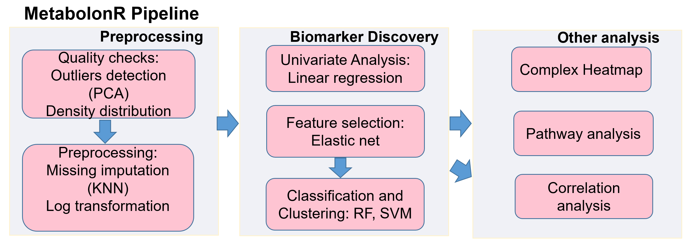

# MetabolonR
MetabolonR: a reproducible Jupyter-notebook workflow for analyzing metabolomics data.

Metabolon is a standardized, open source analysis workflow that can be used as a template for any exploratory metabolomics data analysis. 
This pipeline performs quality checks and preprocessing steps, biomarker discovery using four methods, source of variation analysis, clustering and machine learning classification, and network analysis. 

It is implemented in Jupyter Notebook-R kernel and can be modified or extended for any application, and used to generate publication-quality figures. 

To demonstrate utility of the pipeline, we tested it using metabolomics data generated by Metabolon Inc. 
The samples were composed of 43 lean control versus 88 obese participants to identify metabolites that might be associated with diabetic neuropathy. 
The pipeline identified 5 metabolites that were associated with diabetic neuropathy including: 1,7-dimethylurate, caffeine, ergothioneine, glycocholate glucuronide (1),
and theophylline.

https://nbviewer.jupyter.org/github/FADHLyemen/MetabolonR/blob/master/MetabolonR_pipeline.ipynb
